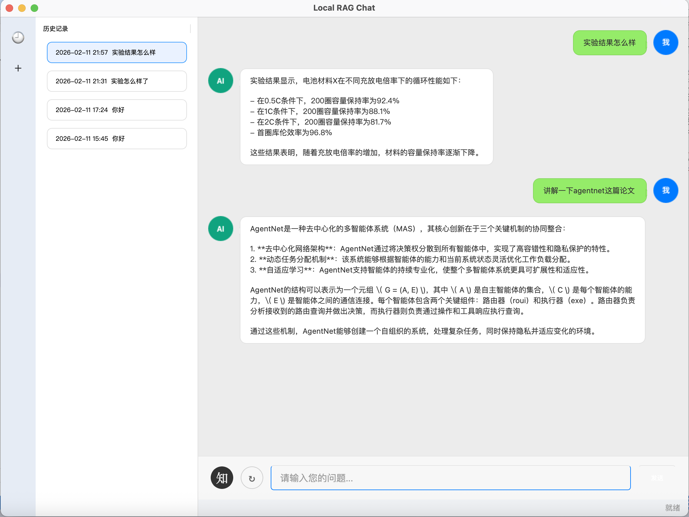

# Local Personalized RAG Assistant

A production‑ready **personalized local assistant** that performs retrieval‑augmented dialogue over user‑provided files. It combines a local knowledge base, vector search, and LLM API calls with a desktop UI for daily research or work collaboration.



## Highlights
- **Local knowledge base** with note/paper categories and file management
- **RAG pipeline**: loading → splitting → embedding → vector search → prompt → response
- **Local embeddings** with `bge-m3` + `sentence-transformers`
- **Chroma** persistent vector store
- **LangChain** for RAG + agent tool interface
- **Desktop UI** (PySide6): chat, drag‑and‑drop import, indexed search, and history

## Architecture Overview
```
User files → loaders → splitters → embeddings → Chroma
                                  ↑         ↓
                             query embed  retriever
                                  ↓         ↓
                               prompt + history → LLM API → response
```

## Project Structure
```
local agent/
  framework/
    main.py                 # framework entry
    config/
      settings.yaml         # configuration
      loader.py             # config loader/validator
      env_check.py          # environment checks
    ingest/
      loaders.py            # file loaders
      splitters.py          # text splitters
      indexer.py            # embeddings + indexing
      file_manager.py       # file import helpers
      service.py            # ingest orchestration
      cli_ingest.py         # CLI ingest
    rag/
      prompt.py             # prompt template
      retriever.py          # vector retriever
      chat.py               # RAG QA
      agent.py              # tool-based agent
    ui/
      window.py             # PySide6 desktop UI
    data/
      knowledge_base/
        note/
        paper/
      vector_store/
      history.json
```

## Quick Start
```bash
python framework/main.py
```

## CLI Ingest
```bash
python framework/ingest/cli_ingest.py --category note --files /path/to/a.pdf --reindex
```

## Configuration
Edit `framework/config/settings.yaml` to set:
- knowledge base and vector store paths
- embedding model/device
- chunk size/overlap
- LLM API endpoint + key

## Notes
- Files are indexed only after **Rebuild Index** (or `--reindex`) is executed.
- History is stored locally in `framework/data/history.json`.

## Future Work
- Multi-session management (rename/delete/export history)
- Reranker integration for higher retrieval precision
- Hybrid retrieval (BM25 + vector search)
- Streaming responses in UI
- Additional loaders (docx/pptx/xlsx/html) with optional dependencies
- Offline/local LLM support
